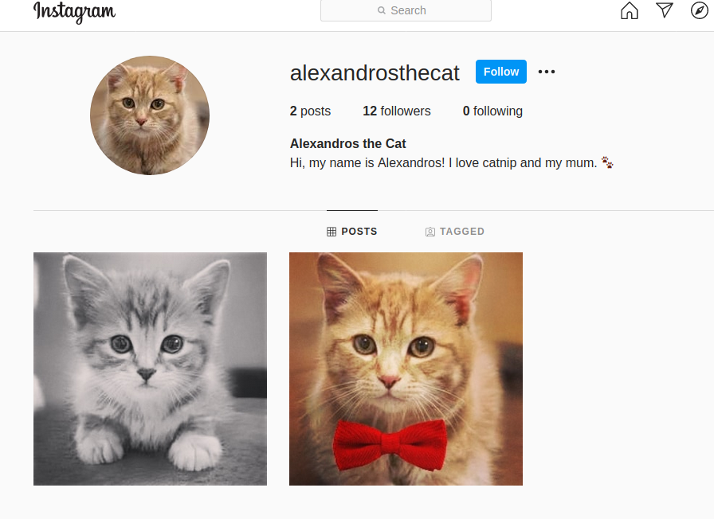
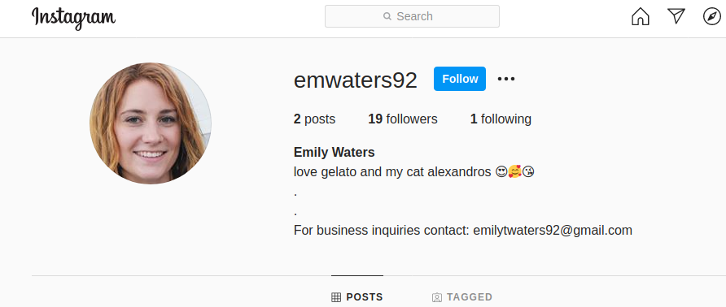
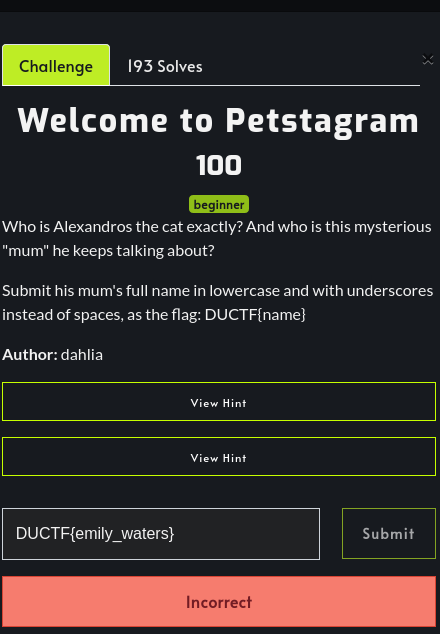
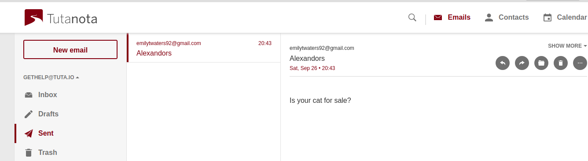
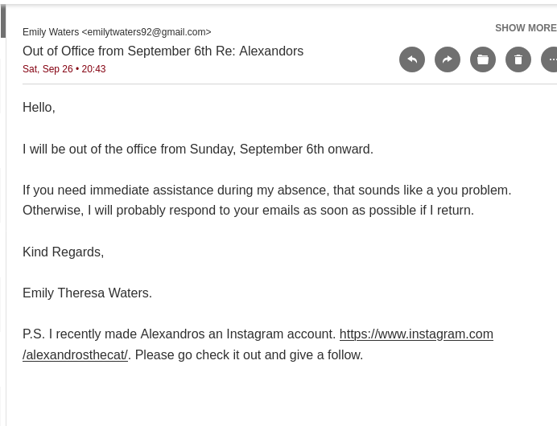

Welcome to Petstagram - DownUnderCTF

# Welcome to Petstagram 

CTF Link: https://play.duc.tf/challenges#Welcome%20to%20Petstagram-29
Difficulty: Beginner

*Who is Alexandros the cat exactly? And who is this mysterious “mum” he keeps talking about?
Submit his mum’s full name in lowercase and with underscores instead of spaces, as the flag: DUCTF{name}*

First step was to google *Alexandros* but search was unsuccessful. 
 
Next step was to search on instagram which lead to this
 
profile.[https://www.instagram.com/alexandrosthecat/](https://www.instagram.com/alexandrosthecat/) 

    

 
 

The last photo had a link to the a youtube page. 

 

The youtube page didn't have any info.

 

Going back to inspect the followers, one stood out cause of her bio  

From this we established her name might be *Emily Waters*. Tried it wasn't the flag. 

 

From the instagram profile there was an email address. We sent an email hoping for a response.

 

We got a response that included her full name:

 DUCTF{emily_theresa_waters}

The flag worked.