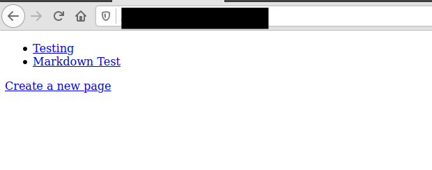
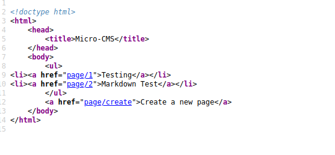
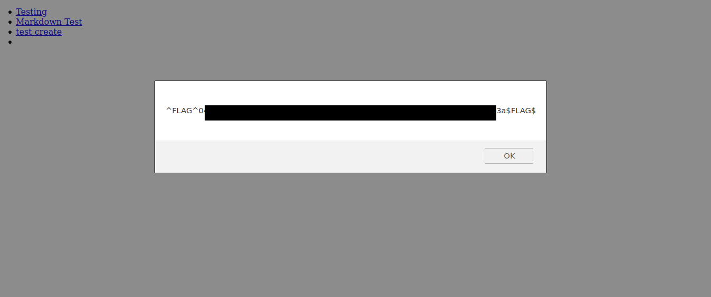
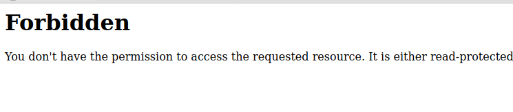
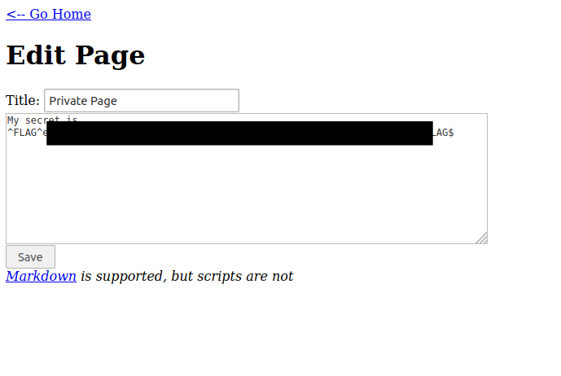
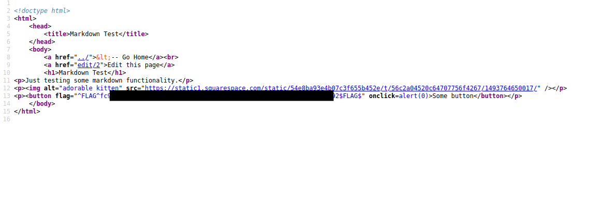

# Micro-CMS v1

#### Introduction


The CTF consists of finding 4 flags.

### Flag 0
After loading the ctf my first step was to check the page source to check if the developer might have left any clue.



There was none, :confused:

The next thing I did was to try and create a page. There was a response indicating that xss is possible.
```
<script>alert("xss test");</script>

```
I used the above payload in the title section and was able to get the first flag.




### Flag 1

Going through the pages I noticed the page url pattern used.
```
http://0.0.0.0/371jjjja/page/1
http://0.0.0.0/371jjjja/page/2
...
http://0.0.0.0/371jjjja/page/11

```
when making a new page, the new page becomes **0.0.0.0/nnnn/page/11** Indicating that page 3-10 are being used.
I started searching the pages. All apart from page 6 didn't exist. 
Page 6 was forbidden.



Going back to edit page 1
I manipulated the url inorder to get to page 6. ie
from:
```
http://0.0.0.0/371jjjja/page/edit/1
```
to:
```

http://0.0.0.0/371jjjja/page/edit/6
```




## Flag 2
To get  this flag I tried adding an apostrophe in the url.

```
http://0.0.0.0/371jjjja/page/edit/6'

```


## Flag 3

For the last flag I edited the button to

```
<button onclick=alert(0)> some button</button>
```
After click the button I views the page source and found the last flag



