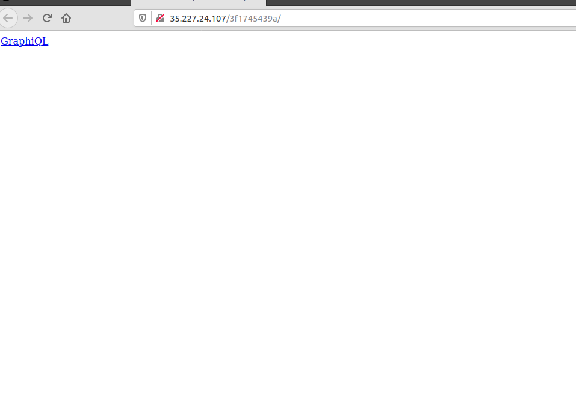
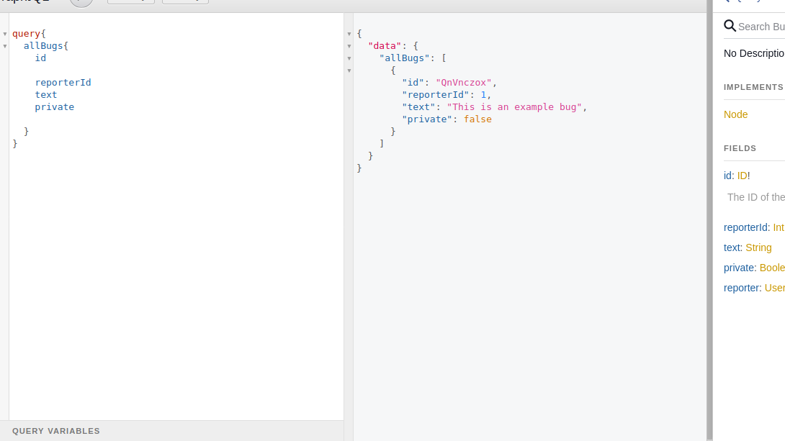
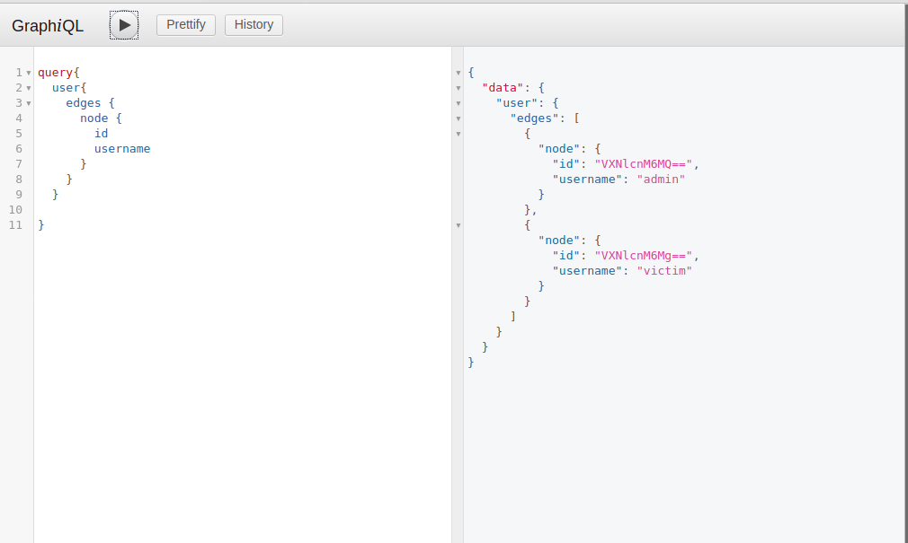
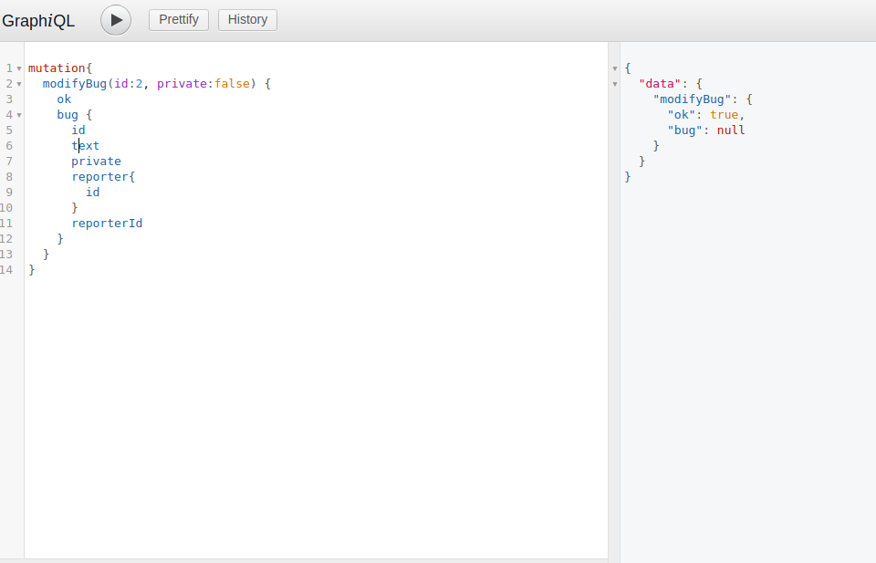
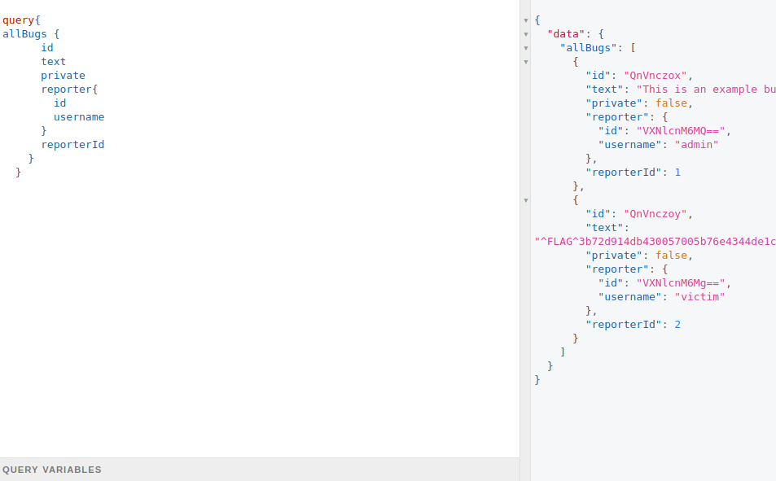

BugDB v2

# BugDB v2
## Flags = 1





## Flag 0


using the docs as a guide I made several queries.








from this I noticed two users , *admin* and *victim*,
After further digging around I didn't find any other clues.
Going back to the root types I started exploring *mutations* , with some googling I came up with a mutation query.
```
mutation{
  modifyBug(id:2, private:false) {
    ok
    bug {
      id
      text
      private
      reporter{
        id
      }
      reporterId
    }
  }
}
```





I then used the query in allBugs
```
query{ 
allBugs {
      id
      text
      private
      reporter{
        id
        username
      }
      reporterId
    }
  }
  
```





This resulted in getting the flag


