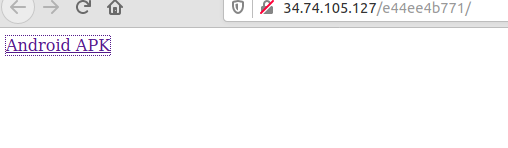
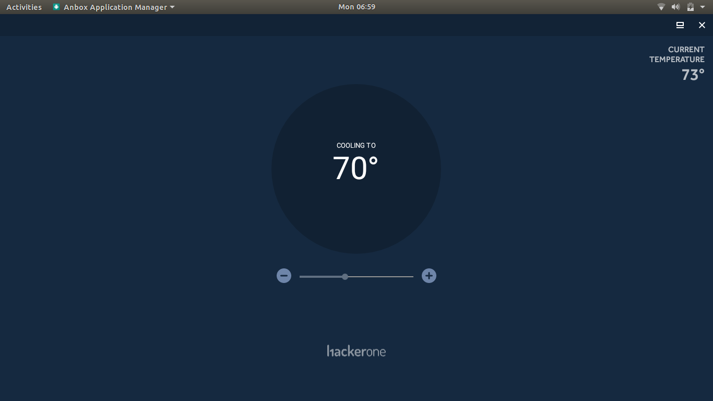
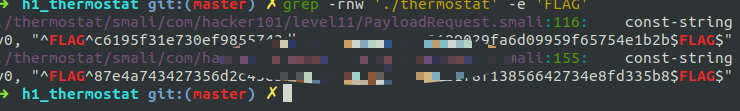

H1 Thermostat

# H1 Thermostat
## Android ctf


## Flag 0/1, 1/1
First step was to install the app and find out how it works. For this I used Anbox emulator.




The app was 'plain' it didn't have any visible buttons apart from the minus and addition buttons.

Next step was to decompile the app. For this i used 
```
apktool d thermostat.apk
```


This created a folder with the source code.
To easily look for the flags I used grep.





Using apktool and grep I was able to find the flags.

