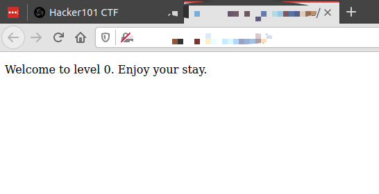
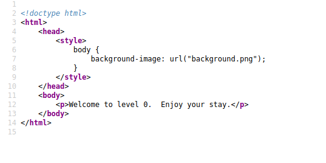
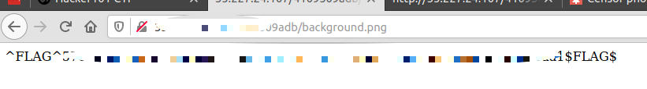

# Trivial


## Flag 1/1
First step was to look at the source code.


the only thing that stood out was background.png
I added that to the url. ie
from
```
http://0.0.0.0/jdjdd/
```

to 
```
http://0.0.0.0/jdjdd/background.png
```

this led to the flag
