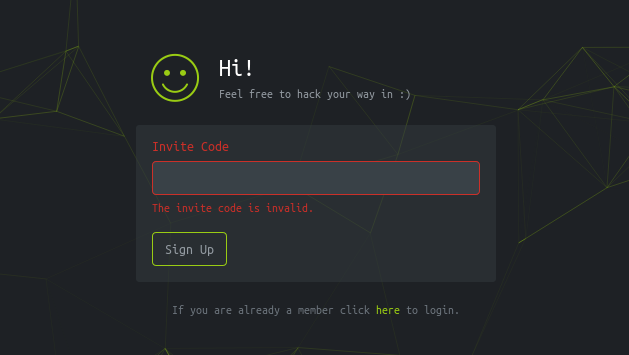
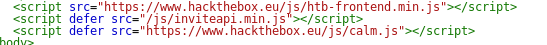
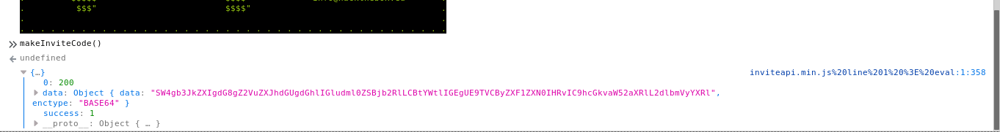
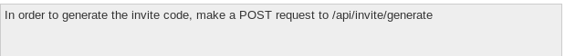
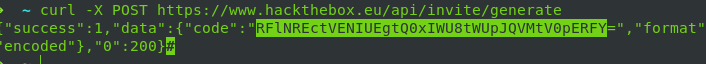
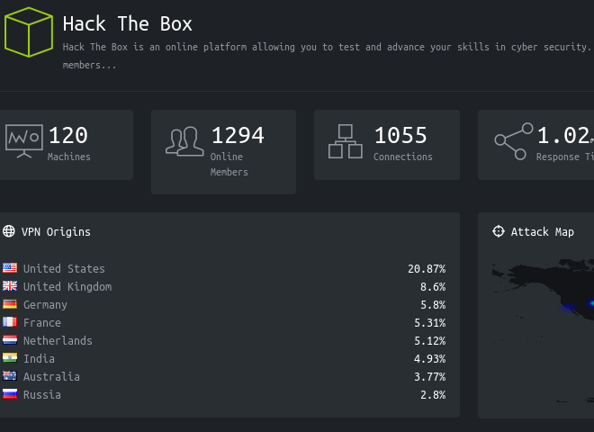

---

author: Muoki Caleb

date:   15th July 2019

---
# Getting invite code https://www.hackthebox.eu

The first thing I tried was try a blank code and one with random values. they were both invalid this indicated that there was some form of validation happening.
 

 

The next step was to go through the source code of the page.
I found a link to a .js file.
 
 
``
 
 

 
 

I followed the link it took me to the js file.
Upon inspection of the code I found a `makeInviteCode()` function.
 

Using Console from the developer tools I called the `makeInviteCode()`  function
  

  
The function returned a base 64 string. I then proceeded to decode it and got.
  

  
Using curl I made a post request.
  

  
The response was an encoded string
 `RFlNREctVENIUEgtQ0xIWU8tWUpJQVMtV0pERFY`
   
After decoding it got the invite code.
  
`DYMDG-TCHPH-CLHYO-YJIAS-WJDDV`
  

After Entering the code I got in.
   

   

   
